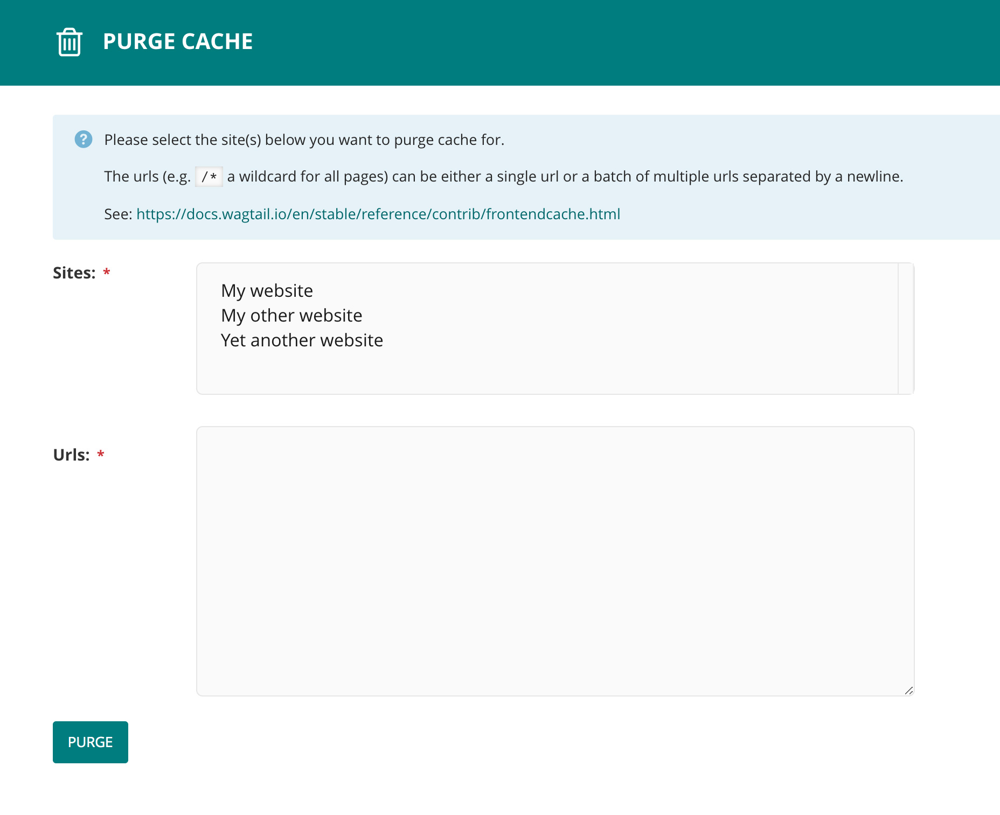

# Wagtail Cache Invalidator

[](https://pypi.python.org/pypi/wagtail-cache-invalidator/)

Invalidate and purge (frontend) cache via an user-friendly interface in the Wagtail CMS.



## Requirements

- Python 3
- Django >= 2
- Wagtail >= 3
- [Frontend cache invalidator](https://docs.wagtail.io/en/stable/reference/contrib/frontendcache.html)

## Installation

Install the package

```
pip install wagtail-cache-invalidator
```

Add `wagtail_cache_invalidator` to your `INSTALLED_APPS` and make sure the [frontend cache invalidator](https://docs.wagtail.io/en/stable/reference/contrib/frontendcache.html) is setup.

```
INSTALLED_APPS = [
    ...
    "wagtail_cache_invalidator",
]
```

Run migrate

```
manage.py migrate
```
